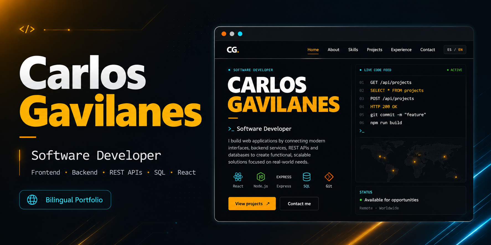

  

<h1 align="center">Hi, I'm Carlos Gavilanes </h1>

<h3 align="center">Software Developer | Full Stack Development</h3>

  I build modern web applications by connecting frontend interfaces,
  backend services, REST APIs and databases.

  <a href="https://portafolio-carlos-eosin.vercel.app/">
     View Portfolio
  </a>
  &nbsp;&nbsp;•&nbsp;&nbsp;
  <a href="mailto:cgavilanes.dev@gmail.com">
     Contact Me
  </a>

---

##  About Me

I'm a **Junior Software Developer** focused on Full Stack web development.

I enjoy building functional and scalable applications while continuously improving my knowledge of software architecture, APIs, databases, cloud environments and secure development practices.

-  Frontend & Backend development
-  REST API development and integration
-  Relational databases and SQL
-  Cloud and Linux fundamentals
-  AI-assisted software development
-  Secure development fundamentals
-  Continuous learning and professional growth

---

##  Tech Stack

### Frontend

  
  
  
  

### Backend & Data

  
  
  
  
  

### Tools & Cloud

  
  
  
  
  
  

---

##  Featured Projects

###  Professional Portfolio

A bilingual **Spanish / English** portfolio built to showcase my skills, experience and software projects.

**Technologies**

`React` `JavaScript` `Vite` `CSS3` `Formspree` `Vercel`

 [Live Portfolio](https://portafolio-carlos-eosin.vercel.app/)

 [Repository](https://github.com/CalucoG/portafolio-carlos)

---

###  Inventory Management System

Full Stack application focused on product management and inventory control.

Current backend features:

- REST API
- CRUD operations
- Data validation
- Node.js
- Express

Next development stages:

- MySQL integration
- React frontend
- Authentication
- Deployment

 **Currently in development**

---

##  Currently Learning

I'm continuously strengthening my knowledge in:

- Full Stack architecture
- Advanced React
- Node.js & Express
- MySQL
- REST API design
- Cloud deployment
- Linux environments
- Web security
- AI-assisted development

---

##  AI-Assisted Development

I use AI development tools such as **Claude Code** to support:

- Code analysis
- Debugging
- Refactoring
- Documentation
- Development automation
- Code optimization

AI-generated or modified code is reviewed, tested and validated before being integrated into my projects.

---

##  Portfolio

My professional portfolio is available in **Spanish and English**:

###  [portafolio-carlos-eosin.vercel.app](https://portafolio-carlos-eosin.vercel.app/)

---

##  Contact

**Email**

 cgavilanes.dev@gmail.com

**GitHub**

 [github.com/CalucoG](https://github.com/CalucoG)

---

  <strong>Building software. Learning continuously. Improving with every project.</strong>

